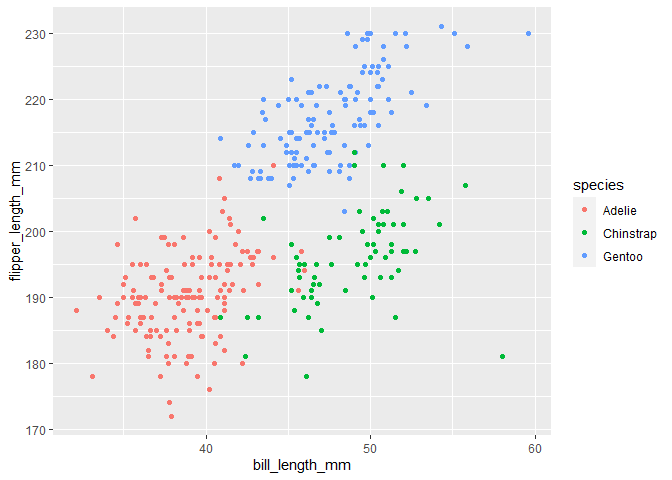

p8105_hw1_YOURUNI.Rmd
================

``` r
library(tidyverse)
```

    ## Warning: package 'tidyverse' was built under R version 4.1.3

    ## -- Attaching packages --------------------------------------- tidyverse 1.3.2 --
    ## v ggplot2 3.3.5     v purrr   0.3.4
    ## v tibble  3.1.6     v dplyr   1.0.7
    ## v tidyr   1.1.4     v stringr 1.4.0
    ## v readr   2.1.1     v forcats 0.5.1
    ## -- Conflicts ------------------------------------------ tidyverse_conflicts() --
    ## x dplyr::filter() masks stats::filter()
    ## x dplyr::lag()    masks stats::lag()

``` r
library(tidyr)
```

# p8105 HW1 yl5215

## Probelm 1

The following code loads the `penguins` dataset:

``` r
data("penguins", package = "palmerpenguins")
```

The following code omits missing values in `penguins` and extrats
`species`, `flipper_length_mm`, and `island` from `penguins`.

``` r
penguins = drop_na(penguins)
flipper_length_mm = pull(penguins, flipper_length_mm)
species = pull(penguins, species)
island = pull(penguins, island)
```

The `penguins` dataset descibes properties of Adelie, Chinstrap, Gentoo
living in Biscoe, Dream, Torgersen. It includes 333 rows and 8 columns,
and it contains variables species, island, bill_length_mm,
bill_depth_mm, flipper_length_mm, body_mass_g, sex, year.

The following code computes the mean of `flipper_length_mm`.

``` r
mean(flipper_length_mm)
```

    ## [1] 200.967

So the mean of flipper length is 200.966967.

The following code draws a scatter plot of `flipper_length_mm` (y) vs
`bill_length_mm` (x).

``` r
ggplot(penguins, aes(x = bill_length_mm, y = flipper_length_mm, color = species)) + geom_point()
```

<!-- -->

The following code saves the plot above to `scatter_plot.pdf`.

``` r
ggsave ("scatter_plot.pdf", height = 4, width = 6)
```

## Problem 2

The following code defines the data frame `my_df`.

``` r
my_df = tibble(
  vec_numeric = rnorm(10),
  vec_logical = vec_numeric > 0,
  vec_char = c("one", "two", "three", "four", "five", "six", "seven", "eight", "night", "ten"),
  vec_factor = factor(c("A", "B", "C", "A", "B", "C", "A", "B", "C", "A"))
)
```

The following code extracts the variables in `my_df`.

``` r
vec_numeric = pull(my_df, vec_numeric)
vec_logical = pull(my_df, vec_logical)
vec_char = pull(my_df, vec_char)
vec_factor = pull(my_df, vec_factor)
```

The means of `vec_numeric`, `vec_logical`, `vec_char`, and `vec_factor`
are 0.1984893, 0.6, NA, and NA. Apparently, taking the mean of
`vec_char` and `vec_factor` does not work.

The following code converts `vec_logical`, `vec_char`, and `vec_factor`
to numeric values and then compute their respective means.

``` r
as.numeric(vec_logical)
```

    ##  [1] 1 1 0 1 0 1 0 1 1 0

``` r
as.numeric(vec_char)
```

    ## Warning: NAs introduced by coercion

    ##  [1] NA NA NA NA NA NA NA NA NA NA

``` r
as.numeric(vec_factor)
```

    ##  [1] 1 2 3 1 2 3 1 2 3 1

``` r
mean(as.numeric(vec_logical))
```

    ## [1] 0.6

``` r
mean(as.numeric(vec_char))
```

    ## Warning in mean(as.numeric(vec_char)): NAs introduced by coercion

    ## [1] NA

``` r
mean(as.numeric(vec_factor))
```

    ## [1] 1.9

Apparently, `vec_char` cannot be converted to numeric values. It is
probably because the character variable is just text, and therefore it
cannot be meaningfully converted to numeric values.

It seems that when the mean of `vec_logical` is computed, `TRUE`s are
treated as 1, and `FALSE`s are treated as 0, so the mean `vec_logical`
can be computed.

The mean of `vec_factor` can be computed after converting `vec_factor`
to numeric values by the function `as.numeric`, but the mean of
`vec_char` cannot be computed either way because the character variable
is just text.
